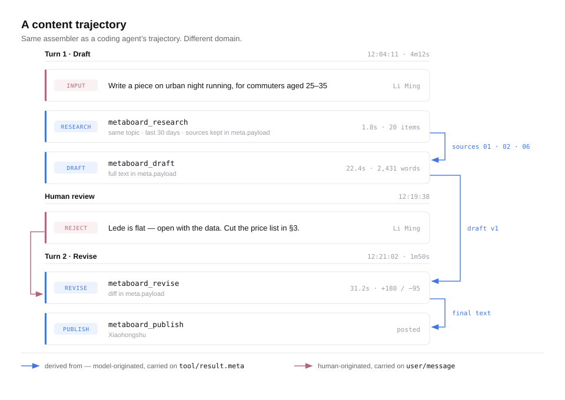
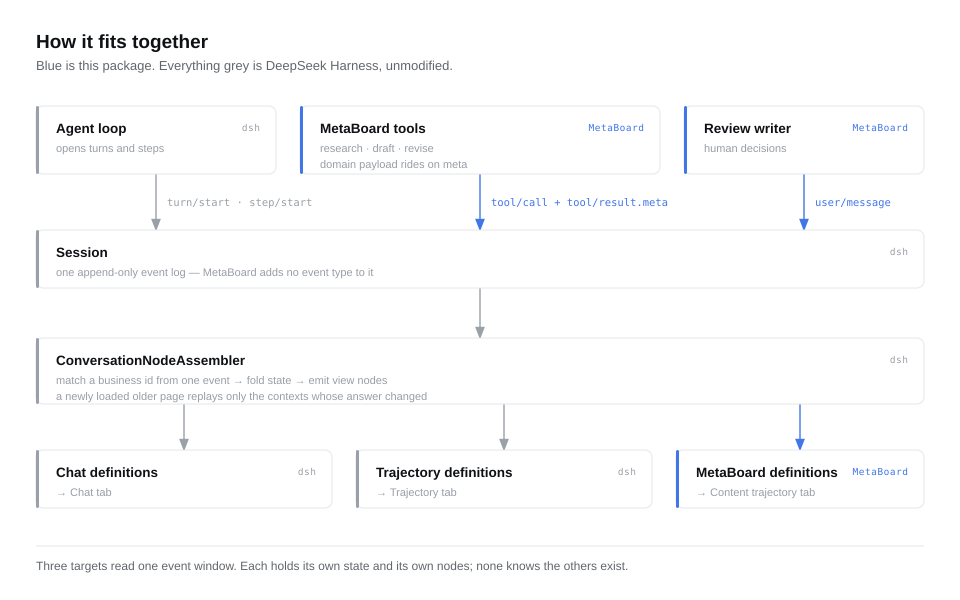

# MetaBoard

**Execution trajectories for work that isn't code.**

English | [简体中文](README.zh-CN.md)

Coding agents produce something most other tools don't: a durable, inspectable record of
*how the work actually happened*. Every retrieval, every tool call, every retry lands as a
structured event — because the executor emits it, not because anyone remembered to log it.

Content creation has no such record. A task board tells you a draft moved from `todo` to
`in_review`. It cannot tell you which twenty articles the outline was derived from, how long
the second revision took, or what the editor's rejection actually said. Those are the facts
you need when a piece underperforms and you want to know why.

MetaBoard brings the agent trajectory to non-coding work, starting with content production.

---

## Status

Phase 1 — the standalone dsh plugin form — is implemented and was verified against real
sessions; [`docs/phase-1-acceptance.md`](docs/phase-1-acceptance.md) is the record. The current
branch adds the CLI, projects, the comment stream, and conversation-bound claims on top of that,
with the test suite green throughout.

Two acceptance items are still open, both because they need a live dsh session to exercise: an
end-to-end walk through the full loop, and two conversations racing to claim the same work item.
The claim conflict has unit coverage — it has not yet been run against a real runtime.

If you are looking for something to install today, come back later. If you are interested in
how execution trajectories generalize beyond software, read on.

---

## The idea

MetaBoard is a plugin for [DeepSeek Harness](https://github.com/deepseek-ai/deepseek-harness)
(`dsh`). It reuses the part of `dsh` that is genuinely hard and genuinely domain-neutral —
the conversation node assembler — and replaces the part that is coding-specific.

The assembler turns a raw event stream into materialized business objects: each registered
definition extracts a stable business ID from a single event, folds state across matching
events, and emits view nodes. When an older page of history loads, only the contexts whose
answers changed are replayed. That incremental-replay behavior is what makes a long trajectory
stay responsive, and it is the piece you would least want to reimplement.

Nothing in that machinery knows about tokens, tool schemas, or TTFT. Those live one layer up,
in the trajectory UI's own definitions. Swap that layer and the same engine renders a
different domain.

### What a content trajectory looks like

<picture>
  <source media="(prefers-color-scheme: dark)" srcset="docs/assets/trajectory-dark.svg">
  
</picture>

The vertical order is time. The blue edges are what a task board cannot express: which
sources the draft came from, which draft the revision rewrote. They are not inferred — each
tool records them on its own result.

Selecting a row opens the full payload: the retrieved sources, the complete draft, what it was
derived from, how long it took.

---

## How it works

<picture>
  <source media="(prefers-color-scheme: dark)" srcset="docs/assets/architecture-dark.svg">
  
</picture>

MetaBoard ships as an ordinary out-of-repo npm package with two halves:

**Host half** registers content-production tools. Each call produces the core `tool/call` and
`tool/result` events; the domain payload rides on `tool/result.meta`, a tool-private,
core-opaque, durably persisted JSON channel that `dsh` already provides.

**Client half** registers its own conversation definitions and a view tab. Definitions claim
only MetaBoard's own calls, assemble them into domain objects, and render them.

No fork. No changes to the host. No new event types.

That last constraint is not a stylistic preference — it is a boundary discovered by testing,
and it shaped the entire design. See below.

---

## Commands and tools

MetaBoard has two surfaces: a CLI a person runs directly, and a set of dsh tools an agent calls
from inside a conversation. Both write to the same work-item log; either side can approve,
comment on, or refile a work item the other created.

### CLI

| Command | What it does |
|---|---|
| `metaboard new <title> [--project <pid>]` | Record an idea. Lands in the backlog — not yet approved for an agent to touch. |
| `metaboard approve <id>` | Approve: let an agent claim and start work. |
| `metaboard ls [--project <pid>] [--all]` | The board — approved work only, grouped by status. `--all` adds backlog, done, and canceled. |
| `metaboard show <id>` | The item's full timeline: board actions and dsh session events, merged into one line of history. |
| `metaboard status <id> <status>` | Move an item to any status. |
| `metaboard comment <id> <body>` | Leave a note — a requirement, a question, a clarification. |
| `metaboard return <id> <reason>` | Send work back: `in_review` → `in_progress`, with the reason recorded as a comment. |
| `metaboard rename <id> <title>` | Rename a work item. |
| `metaboard archive <id>` | Archive. This hides the item from the board; it does not delete its history. |
| `metaboard set-project <id> <pid\|->` | Assign a work item to a project, or `-` to clear the assignment. |
| `metaboard project new <name> [--path <dir>]` | Create a project. `--path` stores an absolute directory on the project record — nothing on this branch resolves a working directory back to a project from it yet. |
| `metaboard project ls` | List projects. |
| `metaboard project rename <pid> <name>` | Rename a project. |
| `metaboard project archive <pid>` | Archive a project. Items assigned to it are unaffected. |
| `metaboard doctor` | Check that the work-item log, the project log, and the dsh session store are all reachable. |

### dsh tools

| Tool | What it does |
|---|---|
| `metaboard_work_create` | Record a new work item, optionally naming its project. Lands in the backlog — recording a requirement is not approval to act on it. |
| `metaboard_research` | Record source material already gathered, verbatim. |
| `metaboard_draft` | Record a draft already written, verbatim. |
| `metaboard_revise` | Record a revision and the notes it was based on, verbatim. |
| `metaboard_review` | Record a human review decision into the trajectory. |
| `metaboard_work_read` | Read a work item's title, status, project, and comment stream. Reading needs no approval. |
| `metaboard_report` | Write the agent's own account of what it did into the comment stream, and optionally hand the item back for review. |

---

## What's already verified

Before writing product code, the feasibility boundary was probed directly against the upstream
codebase, with a test that persists to a real JSONL log and reads it back through a freshly
mounted stack. Six propositions, all confirmed:

| # | Proposition | Result |
|---|---|---|
| 1 | Does `Session.append` let a plugin mark its event ignorable? | **No.** The public write API cannot set the marker. |
| 2 | What happens to a log containing a plugin's own event type? | **Whole log refused** — `SessionFormatUnsupportedError`, not a skipped row. |
| 3 | Does the same event survive when marked ignorable? | **Yes**, byte-identical. The storage layer supports it; only the write path is closed. |
| 4 | Does a 50 KB `tool/result.meta` round-trip through a real file? | **Yes.** Not spilled, not truncated. |
| 5 | Does a plugin-appended `user/message` round-trip? | **Yes** — no model involvement required. |
| 6 | Do plugin event types enter model context? | **No.** They are not surface-eligible. |

Probe 2 is why MetaBoard defines no event types of its own. Probes 4 and 5 are why it doesn't
need to. Probe 3 documents an escape hatch that exists in storage but is deliberately closed at
the write API — upstream records that `Session.append` gains that surface "with its first user."

---

## Design

The full design document lives outside this repository for now. The decisions that matter:

**Data placement is decided by one question — is it an event or a state?**

| Kind | Example | Where it lives |
|---|---|---|
| Event, model-originated | retrieved sources, draft text, revision diff | `tool/result.meta` |
| Event, human-originated | editorial rejection, urgent instruction | `user/message` (plugin source) |
| State | topic status, assignee, board column, view counts | MetaBoard's own store |

**Context identity is the call, not the topic.** One context per tool call keeps live appends
`O(1)` and keeps a prepend from invalidating an entire topic's history. The topic ID rides in
the node payload and grouping happens at snapshot assembly.

**Failed calls must still write their envelope.** A `tool/result` payload carries no tool name —
only `tool/call` does — and matching cannot consult history. The envelope is the sole claim
signal. A tool that omits it on failure leaves a row that reports "running" forever, and a
reload will not fix it, because that is what the log says.

**References resolve at render time, not through the dependency reader.** Using the reader would
record window-gap dependencies and replay chains on every prepend. Reference targets never
change value — they are merely sometimes unloaded. Rendering an unresolved reference costs a
moment of grey; the alternative costs scroll performance on every long trajectory.

---

## Roadmap

**Phase 1 — feasibility slice.** Three tools, two definitions, one tab, one plain row table.
No inspector, no timeline, no board, no storage layer. The bar: hierarchy assembles, references
resolve, a 50 KB payload survives a reopen, and a failed call renders as a complete failure
rather than a stuck row.

**Phase 2 — work items.** The board view, its own store, cross-session aggregation, platform
metrics ingestion.

**Phase 3 — other domains.** The data placement rules and the envelope are not specific to
content production. Legal review, research synthesis, and design iteration have the same shape:
a multi-step process whose intermediate artifacts matter more than its final state.

---

## Prior art and credit

MetaBoard exists because of two projects:

- [**deepseek-ai/deepseek-harness**](https://github.com/deepseek-ai/deepseek-harness) — the
  assembler, the event stream, the trajectory ledger this design learns from. MIT.
- [**chuspeeism/dashi-taskboard**](https://github.com/chuspeeism/dashi-taskboard) — a
  local-first task board with a workflow graph and third-party publishing nodes. Its separation
  of field-level audit from AI session records is what made the missing layer obvious.

MetaBoard is not affiliated with either project.

---

## License

MIT
