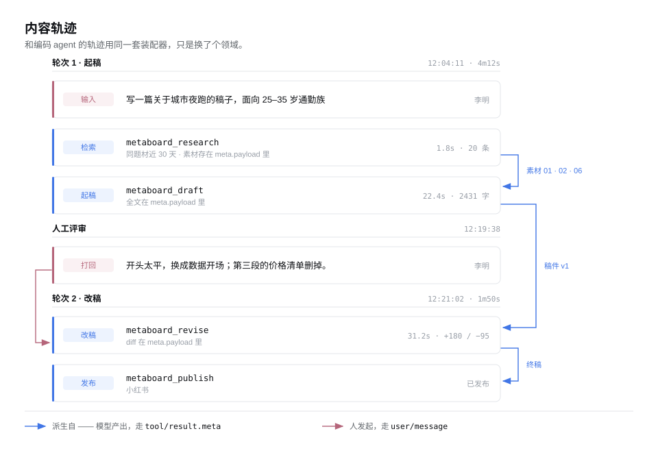
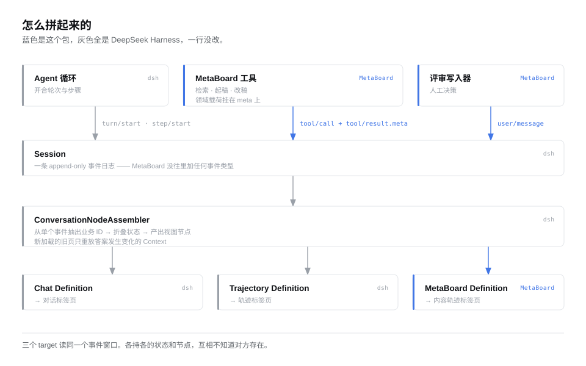

# MetaBoard

**给编码以外的工作，留下可检视的执行轨迹。**

[English](README.md) | 简体中文

编码 agent 有一样别的工具几乎都没有的东西：一份可回溯、可检视的记录，说明这件事**究竟是怎么做成的**。
每一次检索、每一次工具调用、每一次重试都是一条结构化事件——因为执行器自己会掉出来，
不是靠谁记得去记一笔。

内容创作没有这份记录。看板能告诉你一篇稿子从 `todo` 挪到了 `in_review`，
但告诉不了你大纲是从哪二十篇同题材里提炼的、第二次改稿花了多久、编辑打回时具体说了什么。
而这些恰恰是数据不好时你要回头查的东西。

MetaBoard 把 agent 轨迹带到非编码业务上，首个业务域是内容生产。

---

## 当前状态

**设计完成，实现未开始。**

这个仓库现在没有产品代码。有的是一份建立在已验证约束之上的设计——见
[已经验证过什么](#已经验证过什么)。

想找现在就能装的东西，过段时间再来。对「执行轨迹如何脱离软件领域」这个问题感兴趣，可以往下读。

---

## 想法

MetaBoard 是 [DeepSeek Harness](https://github.com/deepseek-ai/deepseek-harness)（`dsh`）的插件。
它复用 `dsh` 里真正难写、也真正与领域无关的那一部分——会话节点装配器，替换掉与编码绑定的那一层。

装配器把原始事件流变成物化的业务对象：每个注册的 Definition 从单个事件里抽出稳定业务 ID，
在匹配到的事件上折叠状态，产出视图节点。旧一页历史加载进来时，只有答案发生变化的 Context 会被重放。
这套增量重放是长轨迹能保持流畅的原因，也是最不该自己重写一遍的部分。

这套机制里没有任何一处知道 token、工具 schema 或 TTFT。那些在上面一层，
在轨迹 UI 自己的 Definition 里。换掉那一层，同一个引擎渲染的就是另一个领域。

### 内容轨迹长什么样

<picture>
  <source media="(prefers-color-scheme: dark)" srcset="docs/assets/trajectory-zh-dark.svg">
  
</picture>

竖向顺序是时间。蓝色的边是看板表达不了的东西:这一稿来自哪几条素材、这一版改的是哪一稿。
它们不是推断出来的——每个工具在自己的结果里就记下了。

选中一行打开完整载荷：检索到的素材、稿件全文、它从哪几条来、花了多久。

---

## 怎么做的

<picture>
  <source media="(prefers-color-scheme: dark)" srcset="docs/assets/architecture-zh-dark.svg">
  
</picture>

MetaBoard 是一个普通的、仓库外的 npm 包，两半：

**host 半**注册内容生产工具。每次调用产生核心的 `tool/call` 和 `tool/result` 事件，
领域载荷挂在 `tool/result.meta` 上——那是 `dsh` 本来就提供的、工具私有、核心不透明、
持久化保存的 JSON 通道。

**client 半**注册自己的会话 Definition 和一个视图标签页。Definition 只认领 MetaBoard 自己的调用，
把它们装配成领域对象再渲染。

不 fork，不改宿主，不加新事件类型。

最后这条不是审美偏好，是测出来的边界，而且它塑造了整个设计。

---

## 已经验证过什么

在写产品代码之前，先直接对着上游代码库把可行性边界探了一遍——测试写进真实的 JSONL 日志，
再用全新挂载的栈读回来。六条命题，全部确认：

| # | 命题 | 结果 |
|---|---|---|
| 1 | `Session.append` 能否让插件把自己的事件标成可忽略 | **不能。** 公开写入 API 打不了这个标记 |
| 2 | 含插件自定义事件类型的日志会怎样 | **整份拒收**——`SessionFormatUnsupportedError`，不是跳过那一行 |
| 3 | 同一条事件带上可忽略标记呢 | **完整读回**，一字不差。存储层支持，只是写入侧没开口 |
| 4 | 50KB 的 `tool/result.meta` 经真实文件往返 | **能**。没被 spill，没被截断 |
| 5 | 插件直接 append 的 `user/message` 能否往返 | **能**——不需要模型参与 |
| 6 | 插件事件类型会不会进模型上下文 | **不会**。它不是 surface 事件类型 |

第 2 条是 MetaBoard 不定义自己事件类型的原因。第 4、5 条是它不需要定义的原因。
第 3 条记录了一个存在于存储层、但在写入 API 上被有意关闭的口子——
上游文档写明 `Session.append` 会「在第一个使用者出现时」补上这个入口。

---

## 设计

完整设计文档暂时不在这个仓库里。要紧的几个决定：

**数据落点只看一个问题——它是事件还是状态。**

| 类别 | 例子 | 落点 |
|---|---|---|
| 事件，模型发起 | 检索到的素材、稿件全文、改稿 diff | `tool/result.meta` |
| 事件，人发起 | 编辑打回、临时指令 | `user/message`（plugin 来源） |
| 状态 | 选题状态、负责人、看板位置、播放量 | MetaBoard 自有存储 |

**Context 身份是一次调用，不是一个选题。** 一次调用一个 Context，
让 live append 保持 `O(1)`，也让 prepend 不会让整个选题的历史失效。
选题 ID 放在节点载荷里，分组在快照装配时做。

**失败的调用也必须写信封。** `tool/result` 的载荷里不带工具名——只有 `tool/call` 带——
而匹配时不能查历史。信封是唯一的认领依据。工具失败时省掉它，账本上就留下一行永远显示
「运行中」的记录，重新加载也不会好，因为日志里存的就是这个。

**引用在渲染时解析，不走依赖 reader。** 走 reader 会记下窗口缺口依赖，
每次往回翻都触发链式重放。而引用指向的目标其值从不改变，只是有时还没加载。
渲染一个未解析的引用，代价是它灰一下；另一条路的代价是每条长轨迹的滚动性能。

---

## 路线

**第一阶段 · 可行性切片。** 三个工具、两个 Definition、一个标签页、一张最简行表。
没有检视面板、没有时间轴、没有看板、没有存储层。及格线：层级装得出来、引用解析得出来、
50KB 载荷重开还在、失败的调用渲染成一行完整的失败记录而不是卡住的行。

**第二阶段 · 工作项。** 看板视图、自有存储、跨会话汇总、平台数据接入。

**第三阶段 · 其他领域。** 数据落点规则和信封不是内容生产专用的。
法务审查、研究综述、设计迭代是同一个形状：一个多步过程，中间产物比最终状态更值得看。

---

## 来源与致谢

MetaBoard 来自两个项目：

- [**deepseek-ai/deepseek-harness**](https://github.com/deepseek-ai/deepseek-harness)——
  装配器、事件流、轨迹账本，这份设计从中学习。MIT。
- [**chuspeeism/dashi-taskboard**](https://github.com/chuspeeism/dashi-taskboard)——
  本地优先的任务看板，带工作流图和第三方发布节点。它把字段级审计和 AI 会话记录分成两套的做法，
  让中间缺的那一层变得明显。

MetaBoard 与这两个项目均无隶属关系。

---

## 许可

MIT
